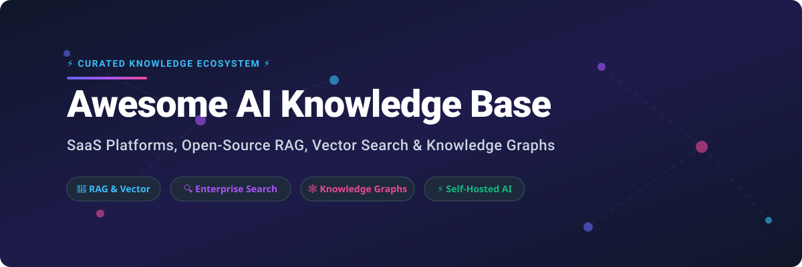

<p align="center">
  
</p>

<p align="center">
  <a href="https://github.com/ishandutta2007/Awesome-Awesome-Awesome"></a><a href="https://discord.gg/jc4xtF58Ve"></a>
  <a href="https://github.com/ishandutta2007/Awesome-AI-Knowledge-Base/stargazers"></a>
  <a href="https://github.com/ishandutta2007/Awesome-AI-Knowledge-Base/network/members"></a>
  <a href="https://github.com/ishandutta2007/Awesome-AI-Knowledge-Base/blob/main/LICENSE"></a>
  <a href="https://github.com/ishandutta2007"></a>
</p>

# 🧠 Awesome AI Knowledge Base 🚀

## 🌟 Top AI Knowledge Base Ecosystem & Architecture Guide


**Curated List of SaaS/Hosted AI Knowledge Bases & Open-Source GitHub Projects**


*Focus: AI knowledge bases, enterprise search, RAG, document intelligence, semantic search, AI assistants, knowledge graphs, connectors, agentic retrieval, and self-hosted alternatives.*


**Last updated: September 2026**


---


## 📋 Table of Contents


* [Overview](#overview)

* [SaaS/Hosted Platforms](#saashosted-platforms)

* [Open-Source](#open-source)


  * [Complete AI Knowledge Base Platforms](#complete-ai-knowledge-base-platforms)

  * [Enterprise Search & Internal Knowledge](#enterprise-search--internal-knowledge)

  * [RAG Platforms](#rag-platforms)

  * [Document Intelligence & Ingestion](#document-intelligence--ingestion)

  * [RAG Frameworks](#rag-frameworks)

  * [Vector Databases](#vector-databases)

  * [Search Engines](#search-engines)

  * [Knowledge Graphs](#knowledge-graphs)

  * [LLM & Model Serving](#llm--model-serving)

  * [Embeddings & Reranking](#embeddings--reranking)

  * [Connectors & Data Ingestion](#connectors--data-ingestion)

  * [Evaluation & Observability](#evaluation--observability)

  * [Workflow & Agent Orchestration](#workflow--agent-orchestration)

  * [UI & Analytics](#ui--analytics)

* [Additional Strong Open-Source Options](#additional-strong-open-source-options)

* [Commercial → Open-Source Mapping](#commercial--open-source-mapping)

* [AI Knowledge Base Capability Matrix](#ai-knowledge-base-capability-matrix)

* [Recommended Open-Source Architecture](#recommended-open-source-architecture)

* [Best Open-Source Combinations](#best-open-source-combinations)

* [Knowledge Base Lifecycle](#knowledge-base-lifecycle)

* [AI Knowledge Retrieval Architecture](#ai-knowledge-retrieval-architecture)

* [Hybrid Search](#hybrid-search)

* [RAG Pipeline](#rag-pipeline)

* [Document Processing](#document-processing)

* [Knowledge Graph Architecture](#knowledge-graph-architecture)

* [Permission-Aware Retrieval](#permission-aware-retrieval)

* [Enterprise Connector Architecture](#enterprise-connector-architecture)

* [Multi-Tenant Architecture](#multi-tenant-architecture)

* [Agentic Knowledge Base](#agentic-knowledge-base)

* [Knowledge Base Analytics](#knowledge-base-analytics)

* [Security](#security)

* [Evaluation & Quality](#evaluation--quality)

* [Open-Source Maturity](#open-source-maturity)

* [What Open Source Can Replace](#what-open-source-can-replace)

* [What Open Source Does Not Automatically Replace](#what-open-source-does-not-automatically-replace)

* [Suggested Technology Stack](#suggested-technology-stack)

* [Example Open-Source AI Knowledge Base Flow](#example-open-source-ai-knowledge-base-flow)

* [Reference Enterprise Architecture](#reference-enterprise-architecture)

* [Recommended Open-Source AI Knowledge Base Stack](#recommended-open-source-ai-knowledge-base-stack)

* [Key Takeaway](#key-takeaway)

* [How to Contribute](#how-to-contribute)

* [Useful Resources](#useful-resources)

* [Disclaimer](#disclaimer)

* [Summary](#summary)


---


# 🔍 Overview


An **AI Knowledge Base** combines traditional document management, enterprise search, semantic retrieval, vector databases, large language models, RAG, knowledge graphs, and AI assistants.


Typical capabilities include:


* Document ingestion

* PDF/DOCX/HTML/Markdown processing

* OCR

* Semantic search

* Keyword search

* Hybrid search

* Vector search

* Metadata filtering

* Reranking

* Retrieval-Augmented Generation (RAG)

* AI question answering

* Citations and source attribution

* Enterprise search

* Slack/Teams/Google Drive/Confluence/GitHub connectors

* Permission-aware retrieval

* Knowledge graphs

* Agentic search

* Deep research

* Multi-model support

* Local LLM support

* API access

* Multi-tenancy

* Analytics

* Evaluation

* Audit logging

* Knowledge freshness and synchronization


The commercial AI knowledge-base market includes products such as **Danswer/Onyx, DocsGPT, Quivr, AnythingLLM, Ragie, Guru, Glean, Hebbia, Notion AI and Slite**.


For organizations prioritizing **open source and self-hosting**, a large portion of this functionality can be assembled from projects such as **Onyx, DocsGPT, Quivr, AnythingLLM, RAGFlow, Open WebUI, Khoj, Haystack, LlamaIndex, Dify, LangChain, Qdrant, Milvus, Weaviate, OpenSearch and PostgreSQL/pgvector**.


Onyx, formerly Danswer, provides an open-source enterprise-search/AI-assistant platform with connectors, RAG, authentication and document-level access controls.


DocsGPT is an open-source platform for agents, assistants, document analysis and enterprise search, with broad document-format support and self-hosting.


AnythingLLM provides a local/self-hostable AI application with document RAG, agents, multi-user support, vector databases and multiple LLM providers.


---


# ☁️ SaaS/Hosted Platforms


### 📊 Market Intelligence & Overview
> **Market Size & Growth:** The Global AI Knowledge Base & Enterprise Search Market was valued at **$6.2 Billion in 2025** and is projected to reach **$32.5 Billion by 2032** at a CAGR of **26.8%**.  
> **Market Structure:** The market is **moderately fragmented**, with hyperscalers (Google Cloud, Microsoft Azure, AWS) and legacy enterprise search giants (Coveo, Elastic) competing against fast-moving AI-native startups (Glean, Hebbia, Onyx).

### 🏆 Top SaaS & Commercial Platforms Matrix

| Rank | Platform | Category | Valuation / Funding / Market Cap | Starting Pricing | Free Tier / Trial Limit | Key Features | Website |
| :---: | :--- | :--- | :--- | :--- | :--- | :--- | :--- |
| **1** | **Google Vertex AI Search** | Enterprise Search / Generative AI | **$2.20 Trillion** (Alphabet Market Cap) | **$2.00** per 1,000 queries | **$300 free credits** for 90 days | Enterprise connectors, RAG, structured/unstructured search | [Website](https://cloud.google.com/enterprise-search) |
| **2** | **Microsoft Azure AI Search** | Enterprise Search / RAG Infra | **$3.10 Trillion** (Microsoft Market Cap) | **$0.34** per hour (~$250/mo Basic) | **Free tier forever** (50 MB index, 3 indexes, 10k docs) | Full-text + Vector search, Semantic ranking, RAG | [Website](https://azure.microsoft.com/products/ai-services/ai-search) |
| **3** | **Amazon Kendra** | Enterprise Search | **$2.00 Trillion** (Amazon Market Cap) | **$1.40** per hour (~$1,008/mo Developer) | **30-day free trial** (up to 750 hours + 10k docs) | Natural language search, ML relevance ranking, connectors | [Website](https://aws.amazon.com/kendra/) |
| **4** | **Notion AI / Q&A** | Workspace AI Knowledge Base | **$10.00 Billion** (Valuation) | **$8.00** per user/month | **20 free AI responses** trial per user | Connected-app search, Q&A, writing assistant, docs | [Website](https://www.notion.com/product/ai) |
| **5** | **Elastic AI Search** | Enterprise / Vector Search | **$9.50 Billion** (Market Cap) | **$95.00** per month (Standard Cloud) | **14-day free trial** (Full capabilities, no credit card) | BM25 + Vector + Hybrid search, RAG, connectors | [Website](https://www.elastic.co/) |
| **6** | **Glean** | Enterprise Search / Work AI | **$4.60 Billion** (Valuation) | **$12.00** per user/month (Est. Enterprise) | **30-day enterprise POC trial** for qualified teams | 100+ connectors, permissions engine, AI agents | [Website](https://www.glean.com/) |
| **7** | **Algolia** | Search-as-a-Service / Neural | **$2.25 Billion** (Valuation) | **$0.50** per 1,000 search requests | **Free forever plan** (10,000 search requests/mo) | Neural search, vector search, RAG APIs, recommendations | [Website](https://www.algolia.com/) |
| **8** | **Coveo** | Enterprise AI Search | **$850 Million** (Market Cap) | **$1,000** per month (Pro Starter) | **30-day guided enterprise trial** | Semantic search, relevance tuning, AI recommendations | [Website](https://www.coveo.com/) |
| **9** | **Hebbia** | AI Knowledge Work / Research | **$700 Million** (Valuation) | **$2,000** per seat/year ($166/mo) | **14-day free trial** (5 workspace analyses) | Matrix multi-document analysis, deep AI research | [Website](https://www.hebbia.com/) |
| **10** | **Guru AI** | Enterprise Knowledge Management | **$500 Million** (Valuation) | **$15.00** per user/month | **30-day free trial** (All feature access) | Knowledge cards, Slack integration, verification engine | [Website](https://www.getguru.com/) |
| **11** | **Onyx (formerly Danswer)** | Enterprise AI Search / RAG | **$50 Million** (Valuation / Raised) | **$12.00** per user/month (Cloud) | **Free forever open-source** / 14-day Cloud trial | Permission-aware search, RAG, 30+ connectors, MCP | [Website](https://onyx.app/) |
| **12** | **Slite AI** | AI Documentation Knowledge Base | **$40 Million** (Valuation) | **$10.00** per user/month | **Free forever plan** (Up to 50 docs, 10 AI questions) | Synchronized search, stale content detection, integrations | [Website](https://slite.com/) |
| **13** | **Ragie** | RAG Infrastructure API | **$20 Million** (Funding) | **$59.00** per month (Developer tier) | **Free forever tier** (10,000 pages parsed & indexed) | Multimodal ingestion, summary/vector indexing, RAG API | [Website](https://www.ragie.ai/) |
| **14** | **AnythingLLM (Hosted)** | Private AI / RAG App | **$15 Million** (Valuation) | **$20.00** per user/month (Cloud) | **Free forever self-hosted** / 14-day Cloud trial | Workspaces, local/cloud LLMs, vector DBs, MCP support | [Website](https://anythingllm.com/) |
| **15** | **Quivr (Hosted)** | AI Second Brain / RAG Platform | **$10 Million** (Valuation) | **$15.00** per user/month | **Free forever tier** (50 MB storage, 1 brain) | RAG brains, custom parsers, multi-LLM support | [Website](https://quivr.app/) |
| **16** | **DocsGPT (Cloud)** | Document AI / Enterprise RAG | **$5 Million** (Valuation) | **$29.00** per month (Starter) | **Free forever self-hosted** / 7-day Cloud trial | Document chat, RAG, agent builder, deep research | [Website](https://docsgpt.cloud/) |

---


# 🔓 Open-Source


## Complete AI Knowledge Base Platforms


These are the most relevant open-source projects when the objective is to build an actual **AI knowledge-base product**, rather than merely a RAG library.


---


## 1. Onyx


**Formerly Danswer**


**Repository:** https://github.com/onyx-dot-app/onyx <a href="https://github.com/onyx-dot-app/onyx/stargazers"></a>


**Best for:**


* Enterprise AI search

* Internal knowledge

* RAG

* Connectors

* Permission-aware search

* AI assistants

* Self-hosted enterprise deployments


Architecture:


```text

                   ┌──────────────────────┐

                   │       Users          │

                   └──────────┬───────────┘

                              │

                              ▼

                   ┌──────────────────────┐

                   │    Onyx / Danswer   │

                   │   Search + Chat     │

                   └──────────┬───────────┘

                              │

             ┌────────────────┼────────────────┐

             ▼                ▼                ▼

        Connectors         RAG            AI Agents

             │                │                │

             ▼                ▼                ▼

       Slack / Drive      Retrieval         Tools

       GitHub / Jira      + Ranking          + MCP

       Confluence

```


Onyx is particularly relevant because it combines enterprise search, connectors, RAG, AI assistants and permission-aware knowledge retrieval in one platform.


---


## 2. DocsGPT


**Repository:** https://github.com/arc53/DocsGPT <a href="https://github.com/arc53/DocsGPT/stargazers"></a>


**Capabilities:**


* Document chat

* RAG

* Agents

* Deep research

* Document analysis

* Multiple LLM providers

* Local deployment

* API integration

* Enterprise search


DocsGPT is MIT licensed.


---


## 3. Quivr


**Repository:** https://github.com/QuivrHQ/quivr <a href="https://github.com/QuivrHQ/quivr/stargazers"></a>


**Capabilities:**


* RAG

* AI assistants

* Document ingestion

* Knowledge bases

* Multiple LLMs

* Vector stores

* Custom parsers

* APIs


Quivr also develops **Megaparse** for document ingestion and **Le Juge** for RAG evaluation.


---


## 4. AnythingLLM


**Repository:** https://github.com/Mintplex-Labs/anything-llm <a href="https://github.com/Mintplex-Labs/anything-llm/stargazers"></a>


**Capabilities:**


* Local AI

* Document RAG

* Workspaces

* Agents

* Multi-user

* Permissions

* Vector databases

* Citations

* APIs

* MCP


AnythingLLM supports both open and commercial LLM providers and multiple vector databases.


---


## 5. RAGFlow


**Repository:** https://github.com/infiniflow/ragflow <a href="https://github.com/infiniflow/ragflow/stargazers"></a>


**Capabilities:**


* Deep document understanding

* RAG

* Agentic workflows

* Document parsing

* Retrieval

* Enterprise knowledge

* Multimodal documents

* Connectors

* Citation-oriented retrieval


RAGFlow positions itself as an open-source RAG engine based on deep document understanding.


---


## 6. Open WebUI


**Repository:** https://github.com/open-webui/open-webui <a href="https://github.com/open-webui/open-webui/stargazers"></a>


**Capabilities:**


* Chat UI

* Local LLMs

* RAG

* Knowledge bases

* Documents

* Model management

* Web search

* APIs

* Multi-user deployments


Open WebUI's Knowledge functionality uses retrieval to search document collections rather than injecting entire document collections into every prompt.


---


## 7. Khoj


**Repository:** https://github.com/khoj-ai/khoj <a href="https://github.com/khoj-ai/khoj/stargazers"></a>


**Capabilities:**


* Personal AI

* Second brain

* Document search

* Semantic search

* Agents

* Web search

* Local LLMs

* Cloud LLMs

* Automation

* Self-hosting


Khoj explicitly supports answers from both the web and personal documents and is self-hostable.


---


## 8. Dify


**Repository:** https://github.com/langgenius/dify <a href="https://github.com/langgenius/dify/stargazers"></a>


**Capabilities:**


* RAG

* Knowledge bases

* AI applications

* Agents

* Workflows

* Model management

* Tool integrations

* Retrieval pipelines

* APIs


---


## 9. FastGPT


**Repository:** https://github.com/labring/FastGPT <a href="https://github.com/labring/FastGPT/stargazers"></a>


**Capabilities:**


* Knowledge bases

* RAG

* Workflow automation

* AI agents

* Document processing

* APIs

* Enterprise deployment


---


## 10. MaxKB


**Repository:** https://github.com/1Panel-dev/MaxKB <a href="https://github.com/1Panel-dev/MaxKB/stargazers"></a>


**Capabilities:**


* Knowledge bases

* RAG

* Document Q&A

* AI assistants

* Workflow integration

* Local/private deployment


---


# Enterprise Search & Internal Knowledge


## 11. Vespa


https://github.com/vespa-engine/vespa <a href="https://github.com/vespa-engine/vespa/stargazers"></a>


* Search

* Vector search

* Hybrid retrieval

* Ranking

* Recommendation

* AI retrieval

* Large-scale serving


---


## 12. OpenSearch


https://github.com/opensearch-project/OpenSearch <a href="https://github.com/opensearch-project/OpenSearch/stargazers"></a>


* Full-text search

* Vector search

* Neural search

* Hybrid search

* RAG retrieval

* Access control

* Analytics


---


## 13. Apache Solr


https://github.com/apache/solr <a href="https://github.com/apache/solr/stargazers"></a>


* Enterprise search

* Full-text search

* Faceting

* Filtering

* Semantic extensions

* Distributed indexing


---


## 14. Meilisearch


https://github.com/meilisearch/meilisearch <a href="https://github.com/meilisearch/meilisearch/stargazers"></a>


* Fast search

* Typo tolerance

* Filtering

* Semantic/vector capabilities

* Developer-friendly APIs


---


## 15. Typesense


https://github.com/typesense/typesense <a href="https://github.com/typesense/typesense/stargazers"></a>


* Search

* Typo tolerance

* Semantic search

* Vector search

* Filtering

* Ranking


---


# RAG Platforms


## 16. LangChain


https://github.com/langchain-ai/langchain <a href="https://github.com/langchain-ai/langchain/stargazers"></a>


* RAG

* Agents

* Tools

* Retrievers

* Memory

* Document loaders

* Model integration


---


## 17. LlamaIndex


https://github.com/run-llama/llama_index <a href="https://github.com/run-llama/llama_index/stargazers"></a>


* Document ingestion

* Indexing

* RAG

* Agents

* Retrieval

* Workflows

* Knowledge graphs


LlamaIndex remains an open toolkit for building RAG and agent applications, although its current company focus also includes commercial document-parsing products.


---


## 18. Haystack


https://github.com/deepset-ai/haystack <a href="https://github.com/deepset-ai/haystack/stargazers"></a>


* Production RAG

* Retrieval pipelines

* Semantic search

* Agents

* Document stores

* Evaluation

* Multimodal pipelines


Haystack describes itself as an open-source AI orchestration framework for production LLM applications, including RAG and semantic search.


---


## 19. DSPy


https://github.com/stanfordnlp/dspy <a href="https://github.com/stanfordnlp/dspy/stargazers"></a>


* Programmatic prompting

* RAG

* Optimization

* Evaluation

* LLM pipelines


---


## 20. txtai


https://github.com/neuml/txtai <a href="https://github.com/neuml/txtai/stargazers"></a>


* Semantic search

* Embeddings

* RAG

* Knowledge extraction

* Workflows

* Vector search


---


# Document Intelligence & Ingestion


## 21. Docling


https://github.com/docling-project/docling <a href="https://github.com/docling-project/docling/stargazers"></a>


* PDF parsing

* Tables

* Layout analysis

* OCR

* Document conversion

* Structured extraction


---


## 22. Apache Tika


https://github.com/apache/tika <a href="https://github.com/apache/tika/stargazers"></a>


* Document extraction

* PDF

* Office documents

* HTML

* Metadata extraction

* Text extraction


---


## 23. Unstructured


https://github.com/Unstructured-IO/unstructured <a href="https://github.com/Unstructured-IO/unstructured/stargazers"></a>


* Document parsing

* PDF

* DOCX

* HTML

* PPTX

* OCR pipelines

* RAG ingestion


---


## 24. Marker


https://github.com/datalab-to/marker <a href="https://github.com/datalab-to/marker/stargazers"></a>


* PDF-to-Markdown

* OCR

* Tables

* Equations

* Document conversion


---


## 25. MinerU


https://github.com/opendatalab/MinerU <a href="https://github.com/opendatalab/MinerU/stargazers"></a>


* PDF parsing

* OCR

* Tables

* Images

* Layout understanding

* Structured extraction


---


## 26. PaddleOCR


https://github.com/PaddlePaddle/PaddleOCR <a href="https://github.com/PaddlePaddle/PaddleOCR/stargazers"></a>


* OCR

* Document understanding

* Layout detection

* Table recognition

* Multilingual extraction


---


## 27. Megaparse


https://github.com/QuivrHQ/MegaParse


* Document ingestion

* Parsing

* Preprocessing

* RAG preparation


Quivr identifies Megaparse as its open-source document-ingestion component.


---


# RAG Frameworks


| Project | Primary Role | Knowledge Base Use |
| :--- | :--- | :--- |
| **LangChain** | LLM orchestration | RAG/agents |
| **LlamaIndex** | Data/RAG framework | Document knowledge |
| **Haystack** | AI orchestration | Enterprise RAG |
| **DSPy** | LLM programming | Optimized RAG |
| **txtai** | Semantic AI | Search/RAG |
| **Semantic Kernel** | AI orchestration | Enterprise AI |
| **AutoGen** | Multi-agent | Research/knowledge |
| **CrewAI** | Agent orchestration | Knowledge agents |
| **Guidance** | Structured LLM control | RAG pipelines |
| **Marvin** | AI engineering | Structured retrieval |


---


# Vector Databases


## 28. Qdrant


https://github.com/qdrant/qdrant <a href="https://github.com/qdrant/qdrant/stargazers"></a>


* Vector search

* Metadata filtering

* Hybrid retrieval

* Quantization

* Multi-tenancy

* RAG


---


## 29. Milvus


https://github.com/milvus-io/milvus <a href="https://github.com/milvus-io/milvus/stargazers"></a>


* Distributed vector database

* ANN search

* Hybrid retrieval

* Large-scale embeddings

* Metadata filtering


---


## 30. Weaviate


https://github.com/weaviate/weaviate <a href="https://github.com/weaviate/weaviate/stargazers"></a>


* Vector database

* Hybrid search

* Semantic search

* RAG

* Multimodal vectors


---


## 31. Chroma


https://github.com/chroma-core/chroma <a href="https://github.com/chroma-core/chroma/stargazers"></a>


* Embeddings

* Vector search

* Metadata

* RAG

* Developer-friendly deployment


---


## 32. pgvector


https://github.com/pgvector/pgvector <a href="https://github.com/pgvector/pgvector/stargazers"></a>


* PostgreSQL vector search

* Embeddings

* ANN search

* Hybrid PostgreSQL applications

* RAG


---


## 33. LanceDB


https://github.com/lancedb/lancedb <a href="https://github.com/lancedb/lancedb/stargazers"></a>


* Vector search

* Multimodal data

* Embeddings

* AI retrieval

* RAG


---


## 34. Vespa


https://github.com/vespa-engine/vespa <a href="https://github.com/vespa-engine/vespa/stargazers"></a>


* Vector search

* Full-text search

* Hybrid retrieval

* Ranking

* Large-scale AI search


---


# Search Engines


## 35. OpenSearch


https://github.com/opensearch-project/OpenSearch <a href="https://github.com/opensearch-project/OpenSearch/stargazers"></a>


Best open-source choice for:


* Keyword search

* BM25

* Vector search

* Hybrid search

* Enterprise indexing

* RAG


---


## 36. Elasticsearch


https://github.com/elastic/elasticsearch


* Full-text search

* Vector search

* Semantic search

* Hybrid retrieval

* Analytics


---


## 37. Apache Solr


https://github.com/apache/solr <a href="https://github.com/apache/solr/stargazers"></a>


* Enterprise search

* Distributed indexing

* Faceted search

* Text analysis

* Ranking


---


# Knowledge Graphs


## 38. Neo4j


https://github.com/neo4j/neo4j <a href="https://github.com/neo4j/neo4j/stargazers"></a>


* Knowledge graphs

* Entity relationships

* Graph retrieval

* GraphRAG

* Enterprise knowledge modeling


---


## 39. Apache Jena


https://github.com/apache/jena <a href="https://github.com/apache/jena/stargazers"></a>


* RDF

* SPARQL

* Semantic web

* Knowledge graphs


---


## 40. JanusGraph


https://github.com/JanusGraph/janusgraph <a href="https://github.com/JanusGraph/janusgraph/stargazers"></a>


* Distributed graph database

* Knowledge graphs

* Relationship discovery


---


## 41. Memgraph


https://github.com/memgraph/memgraph <a href="https://github.com/memgraph/memgraph/stargazers"></a>


* Graph database

* Knowledge graphs

* Graph analytics

* Graph-based retrieval


---


## 42. GraphRAG


https://github.com/microsoft/graphrag <a href="https://github.com/microsoft/graphrag/stargazers"></a>


* Knowledge graph extraction

* Community detection

* Graph-based retrieval

* Global/local search

* RAG


---


# LLM & Model Serving


## 43. Ollama


https://github.com/ollama/ollama <a href="https://github.com/ollama/ollama/stargazers"></a>


* Local LLM inference

* Model management

* Embeddings

* Private AI


---


## 44. vLLM


https://github.com/vllm-project/vllm <a href="https://github.com/vllm-project/vllm/stargazers"></a>


* High-throughput inference

* OpenAI-compatible APIs

* Production LLM serving


---


## 45. llama.cpp


https://github.com/ggml-org/llama.cpp <a href="https://github.com/ggml-org/llama.cpp/stargazers"></a>


* Local inference

* CPU/GPU

* Quantized models

* Edge AI


---


## 46. LocalAI


https://github.com/mudler/LocalAI <a href="https://github.com/mudler/LocalAI/stargazers"></a>


* Local OpenAI-compatible API

* LLM inference

* Embeddings

* Speech

* Image models


---


## 47. Text Generation Inference


https://github.com/huggingface/text-generation-inference


* Production LLM serving

* GPU inference

* Streaming

* Quantization


---


# Embeddings & Reranking


## 48. Sentence Transformers


https://github.com/UKPLab/sentence-transformers


* Embeddings

* Semantic search

* Reranking

* Similarity


---


## 49. BGE


https://huggingface.co/BAAI


* Embeddings

* Retrieval

* Reranking


---


## 50. Jina AI Embeddings


https://github.com/jina-ai


* Long-context embeddings

* Retrieval

* Reranking


---


## 51. ColBERT


https://github.com/stanford-futuredata/ColBERT


* Late-interaction retrieval

* Semantic search

* High-quality ranking


---


# Connectors & Data Ingestion


A production knowledge base needs connectors as much as it needs an LLM.


Typical connectors include:


```text

Slack

Google Drive

Microsoft SharePoint

OneDrive

Notion

Confluence

GitHub

GitLab

Jira

Zendesk

Gmail

Linear

Dropbox

Box

S3

PostgreSQL

MySQL

MongoDB

Websites

Local Files

Email

CRM

ERP

```


Open-source building blocks include:


### Apache Airbyte


https://github.com/airbytehq/airbyte


* Data connectors

* ELT

* API ingestion

* Database synchronization


### Meltano


https://github.com/meltano/meltano


* Data integration

* ELT

* Connector orchestration


### dlt


https://github.com/dlt-hub/dlt


* Python data pipelines

* API ingestion

* Database loading


### Nango


https://github.com/NangoHQ/nango


* SaaS integrations

* OAuth

* API synchronization

* Connector infrastructure


---


# Evaluation & Observability


## 52. Ragas


https://github.com/explodinggradients/ragas <a href="https://github.com/explodinggradients/ragas/stargazers"></a>


* RAG evaluation

* Faithfulness

* Context relevance

* Answer relevance


---


## 53. DeepEval


https://github.com/confident-ai/deepeval <a href="https://github.com/confident-ai/deepeval/stargazers"></a>


* LLM evaluation

* RAG evaluation

* Agent evaluation

* Regression testing


---


## 54. TruLens


https://github.com/truera/trulens <a href="https://github.com/truera/trulens/stargazers"></a>


* RAG evaluation

* Feedback functions

* LLM observability


---


## 55. Arize Phoenix


https://github.com/Arize-ai/phoenix <a href="https://github.com/Arize-ai/phoenix/stargazers"></a>


* LLM tracing

* RAG evaluation

* Retrieval analysis

* Observability


---


## 56. Langfuse


https://github.com/langfuse/langfuse <a href="https://github.com/langfuse/langfuse/stargazers"></a>


* LLM tracing

* Prompt management

* Evaluation

* Cost analytics

* RAG observability


---


# Workflow & Agent Orchestration


## 57. n8n


https://github.com/n8n-io/n8n


* Workflow automation

* AI agents

* Connectors

* Webhooks

* RAG workflows


---


## 58. Temporal


https://github.com/temporalio/temporal


* Durable workflows

* Long-running knowledge ingestion

* Background jobs

* Agent orchestration


---


## 59. Apache Airflow


https://github.com/apache/airflow


* ETL

* Scheduled indexing

* Data pipelines

* Knowledge refresh


---


## 60. Prefect


https://github.com/PrefectHQ/prefect


* Data workflows

* Ingestion

* Scheduled pipelines

* AI pipelines


---


# UI & Analytics


## Grafana


https://github.com/grafana/grafana


* Knowledge-base analytics

* Retrieval latency

* System metrics

* LLM metrics


## Apache Superset


https://github.com/apache/superset


* Analytics

* Dashboards

* SQL

* Usage reporting


## Metabase


https://github.com/metabase/metabase


* BI

* Search analytics

* Usage dashboards

* Knowledge metrics


---


# Additional Strong Open-Source Options


| Project      | Category             | Relevance |
| ------------ | -------------------- | --------- |
| Onyx         | Enterprise AI Search | Very High |
| DocsGPT      | AI Knowledge Base    | Very High |
| AnythingLLM  | Private AI/RAG       | Very High |
| Quivr        | RAG Knowledge Base   | Very High |
| RAGFlow      | Deep RAG             | Very High |
| Open WebUI   | AI/RAG UI            | Very High |
| Khoj         | Personal Knowledge   | High      |
| Dify         | AI/RAG Platform      | Very High |
| FastGPT      | Knowledge Base       | High      |
| MaxKB        | Knowledge Base       | High      |
| Haystack     | RAG Framework        | Very High |
| LlamaIndex   | RAG Framework        | Very High |
| LangChain    | RAG/Agents           | Very High |
| OpenSearch   | Search/RAG           | Very High |
| Qdrant       | Vector DB            | Very High |
| Milvus       | Vector DB            | Very High |
| Weaviate     | Vector DB            | Very High |
| pgvector     | Vector DB            | Very High |
| Neo4j        | Knowledge Graph      | High      |
| GraphRAG     | Graph RAG            | Very High |
| Docling      | Document AI          | Very High |
| Unstructured | Document ETL         | Very High |
| Apache Tika  | Extraction           | High      |
| MinerU       | Document AI          | High      |
| PaddleOCR    | OCR                  | High      |
| Airbyte      | Connectors           | High      |
| Nango        | Integrations         | High      |
| Ragas        | Evaluation           | Very High |
| Langfuse     | Observability        | Very High |
| Phoenix      | Observability        | High      |
| n8n          | Automation           | High      |


---


# 🔄 Commercial → Open-Source Mapping


| Commercial Platform     | Open-Source Equivalent / Building Blocks             |
| ----------------------- | ---------------------------------------------------- |
| Danswer / Onyx          | Onyx + OpenSearch + Qdrant + LLM                     |
| DocsGPT                 | DocsGPT + Qdrant/pgvector + Ollama                   |
| Quivr                   | Quivr + Qdrant/pgvector + local LLM                  |
| AnythingLLM             | AnythingLLM + Ollama + Qdrant                        |
| Ragie                   | Haystack/LlamaIndex + Docling + Qdrant               |
| Guru AI                 | Onyx + OpenSearch + PostgreSQL + connectors          |
| Glean                   | Onyx + OpenSearch + GraphRAG + connectors            |
| Hebbia                  | DocsGPT/RAGFlow + LlamaIndex + structured extraction |
| Notion AI Q&A           | Open WebUI + Qdrant + PostgreSQL + LLM               |
| Slite AI                | Outline/BookStack + Open WebUI + Qdrant + connectors |
| Coveo                   | OpenSearch + Qdrant + reranking                      |
| Azure AI Search         | OpenSearch + Qdrant + Haystack                       |
| Google Vertex AI Search | OpenSearch + RAGFlow + LlamaIndex                    |
| Amazon Kendra           | OpenSearch + Onyx + connector layer                  |
| Enterprise AI Search    | Onyx + OpenSearch + GraphRAG                         |
| Private Document Chat   | AnythingLLM + Ollama                                 |
| Advanced RAG            | RAGFlow + Qdrant + reranker                          |
| Agentic Knowledge Base  | Dify + LlamaIndex + Qdrant                           |
| Knowledge Graph RAG     | GraphRAG + Neo4j + LlamaIndex                        |
| Document Intelligence   | Docling + MinerU + PaddleOCR                         |
| Enterprise Connectors   | Airbyte + Nango + custom connectors                  |
| RAG Evaluation          | Ragas + DeepEval + Phoenix                           |
| LLM Observability       | Langfuse + Phoenix                                   |


---


# 📊 AI Knowledge Base Capability Matrix


| Capability                 | Onyx | DocsGPT | Quivr | AnythingLLM | RAGFlow | Open WebUI |  Haystack | LlamaIndex |
| -------------------------- | ---: | ------: | ----: | ----------: | ------: | ---------: | --------: | ---------: |
| Document RAG               |    ✓ |       ✓ |     ✓ |           ✓ |       ✓ |          ✓ |         ✓ |          ✓ |
| Enterprise Search          |    ✓ |       ✓ |     ✓ |           — |       ✓ |          — |         ✓ |          ✓ |
| Connectors                 |    ✓ |       ✓ |     ✓ |           ✓ |       ✓ |          ✓ |         ✓ |          ✓ |
| Hybrid Search              |    ✓ |       ✓ |     ✓ |           ✓ |       ✓ |          ✓ |         ✓ |          ✓ |
| Citations                  |    ✓ |       ✓ |     ✓ |           ✓ |       ✓ |          ✓ |         ✓ |          ✓ |
| AI Agents                  |    ✓ |       ✓ |     ✓ |           ✓ |       ✓ |          ✓ |         ✓ |          ✓ |
| Multi-LLM                  |    ✓ |       ✓ |     ✓ |           ✓ |       ✓ |          ✓ |         ✓ |          ✓ |
| Local LLM                  |    ✓ |       ✓ |     ✓ |           ✓ |       ✓ |          ✓ |         ✓ |          ✓ |
| Knowledge Graph            |    ✓ |       — |     — |           — |       ✓ |          — |         ✓ |          ✓ |
| Multi-user                 |    ✓ |       ✓ |     ✓ |           ✓ |       ✓ |          ✓ | Framework |  Framework |
| API                        |    ✓ |       ✓ |     ✓ |           ✓ |       ✓ |          ✓ |         ✓ |          ✓ |
| Self-hosting               |    ✓ |       ✓ |     ✓ |           ✓ |       ✓ |          ✓ |         ✓ |          ✓ |
| Permission-aware retrieval |    ✓ |       ✓ |     ✓ |           ✓ |       ✓ |          ✓ |    Custom |     Custom |
| Deep Research              |    ✓ |       ✓ |     — |           ✓ |       ✓ |          — |    Custom |     Custom |
| MCP                        |    ✓ |       ✓ |     ✓ |           ✓ |       ✓ |          ✓ |         ✓ |          ✓ |


---


# 🏗️ Recommended Open-Source Architecture


```text

                         ┌───────────────────────┐

                         │       Users           │

                         │ Web / Mobile / Slack  │

                         └───────────┬───────────┘

                                     │

                                     ▼

                         ┌───────────────────────┐

                         │     AI Knowledge      │

                         │         UI            │

                         │ Open WebUI / Onyx     │

                         └───────────┬───────────┘

                                     │

                                     ▼

                    ┌────────────────────────────────┐

                    │       Retrieval Layer           │

                    │                                │

                    │ Hybrid Search / RAG / Rerank   │

                    └───────────────┬────────────────┘

                                    │

                  ┌─────────────────┼─────────────────┐

                  ▼                 ▼                 ▼

             OpenSearch          Qdrant          PostgreSQL

             BM25/Search         Vectors          Metadata

                  │                 │                 │

                  └─────────────────┼─────────────────┘

                                    │

                                    ▼

                         ┌───────────────────────┐

                         │    Knowledge Graph    │

                         │ Neo4j / GraphRAG      │

                         └───────────┬───────────┘

                                     │

                                     ▼

                         ┌───────────────────────┐

                         │        LLM            │

                         │ Ollama / vLLM / API   │

                         └───────────────────────┘

```


---


# Best Open-Source Combinations


## 1. Simple Private AI Knowledge Base


```text

AnythingLLM

    +

Ollama

    +

LanceDB / Chroma

```


Best for:


* Individuals

* Small businesses

* Private document chat

* Local deployment


---


## 2. Enterprise AI Search


```text

Onyx

    +

OpenSearch

    +

PostgreSQL

    +

Qdrant

    +

Ollama / vLLM

```


Best for:


* Internal company search

* Large document collections

* Permission-aware knowledge

* Multiple enterprise connectors


---


## 3. Advanced RAG Platform


```text

RAGFlow

    +

Docling / MinerU

    +

Qdrant

    +

Cross-Encoder Reranker

    +

vLLM

```


Best for:


* Complex PDFs

* Technical documents

* Research

* Tables and structured documents


---


## 4. Developer-Centric Knowledge Platform


```text

LlamaIndex

    +

Qdrant

    +

PostgreSQL

    +

FastAPI

    +

vLLM

```


Best for:


* Custom applications

* APIs

* AI SaaS products

* Developer platforms


---


## 5. Enterprise RAG with Maximum Control


```text

Haystack

     +

OpenSearch

     +

Qdrant

     +

PostgreSQL

     +

Docling

     +

vLLM

     +

Langfuse

```


Best for:


* Production RAG

* Custom retrieval

* Enterprise search

* Evaluation

* Observability


---


## 6. Knowledge-Graph RAG


```text

Documents

    │

    ▼

Docling

    │

    ▼

Entity Extraction

    │

    ▼

Neo4j / GraphRAG

    │

    ├──────────────┐

    ▼              ▼

Vector DB      Graph DB

    │              │

    └──────┬───────┘

           ▼

       Hybrid RAG

           │

           ▼

          LLM

```


---


# Knowledge Base Lifecycle


```text

1. Collect

   ↓

2. Connect

   ↓

3. Extract

   ↓

4. Parse

   ↓

5. Clean

   ↓

6. Chunk

   ↓

7. Embed

   ↓

8. Index

   ↓

9. Retrieve

   ↓

10. Rerank

   ↓

11. Generate

   ↓

12. Cite

   ↓

13. Evaluate

   ↓

14. Monitor

   ↓

15. Refresh

```


---


# AI Knowledge Retrieval Architecture


```text

User Question

      │

      ▼

Query Understanding

      │

      ├───────────────┐

      ▼               ▼

Keyword Search    Vector Search

      │               │

      └───────┬───────┘

              ▼

        Result Fusion

              │

              ▼

          Reranking

              │

              ▼

       Permission Check

              │

              ▼

      Context Construction

              │

              ▼

             LLM

              │

              ▼

      Answer + Citations

```


---


# Hybrid Search


A strong enterprise knowledge base should generally combine:


```text

BM25 / Keyword Search

          +

Dense Vector Search

          +

Metadata Filtering

          +

Cross-Encoder Reranking

          +

Permission Filtering

```


Example:


```text

                    Query

                      │

           ┌──────────┴──────────┐

           ▼                     ▼

      BM25 Search          Vector Search

           │                     │

           └──────────┬──────────┘

                      ▼

                Reciprocal

               Rank Fusion

                      │

                      ▼

                  Reranker

                      │

                      ▼

                Top-K Context

```


---


# RAG Pipeline


```text

              DOCUMENTS

                  │

                  ▼

          Document Parser

        ┌──────────────────┐

        │ Docling           │

        │ MinerU            │

        │ Tika              │

        │ Unstructured      │

        └────────┬─────────┘

                 │

                 ▼

            Chunking

                 │

                 ▼

            Embeddings

                 │

          ┌──────┴──────┐

          ▼             ▼

       Vector DB      Search DB

       Qdrant         OpenSearch

          │             │

          └──────┬──────┘

                 ▼

            Hybrid Search

                 │

                 ▼

              Reranker

                 │

                 ▼

                LLM

                 │

                 ▼

         Answer + Sources

```


---


# Document Processing


Modern AI knowledge bases should support:


* PDF

* DOCX

* PPTX

* XLSX

* CSV

* HTML

* Markdown

* TXT

* XML

* JSON

* Images

* Scanned documents

* Email

* Audio

* Video

* Web pages

* Code repositories


Recommended stack:


```text

Docling

   +

MinerU

   +

PaddleOCR

   +

Apache Tika

   +

Unstructured

```


---


# Knowledge Graph Architecture


```text

Documents

    │

    ▼

Entity Extraction

    │

    ├─────────────┐

    ▼             ▼

Entities      Relationships

    │             │

    └──────┬──────┘

           ▼

       Knowledge

          Graph

           │

           ▼

     Graph Retrieval

           │

           ▼

       Vector RAG

           │

           ▼

           LLM

```


Useful open-source components:


* Neo4j

* Apache Jena

* JanusGraph

* Memgraph

* GraphRAG

* LlamaIndex

* Haystack


---


# Permission-Aware Retrieval


Enterprise knowledge systems should not simply retrieve the most relevant document.


They should also ask:


```text

Does this user have access?

          │

          ▼

Is the document permitted?

          │

          ▼

Is the source permitted?

          │

          ▼

Is the specific chunk permitted?

          │

          ▼

Retrieve

```


Example:


```text

User

 │

 ▼

Identity Provider

 │

 ▼

RBAC / ABAC

 │

 ▼

Connector Permissions

 │

 ▼

Search

 │

 ▼

Filtered Results

 │

 ▼

LLM

```


This is one of the areas where enterprise platforms such as Onyx/Glean-style systems require more engineering than a simple document chatbot.


---


# Enterprise Connector Architecture


```text

              ┌──────────────┐

              │    Slack     │

              └──────┬───────┘

                     │

┌──────────────┐     │     ┌──────────────┐

│ Google Drive │─────┼─────│  Confluence  │

└──────────────┘     │     └──────────────┘

                     ▼

              Connector Layer

                     │

        ┌────────────┼────────────┐

        ▼            ▼            ▼

     Parser       Metadata      ACL Sync

        │            │            │

        └────────────┼────────────┘

                     ▼

                Indexing

                     │

                     ▼

              Knowledge Base

```


---


# Multi-Tenant Architecture


```text

                    API Gateway

                         │

                         ▼

                   Tenant Router

                         │

         ┌───────────────┼───────────────┐

         ▼               ▼               ▼

      Tenant A        Tenant B        Tenant C

         │               │               │

      Vector DB       Vector DB       Vector DB

         │               │               │

      Metadata        Metadata        Metadata

         │               │               │

         └───────────────┼───────────────┘

                         ▼

                        LLM

```


Use:


* Tenant IDs

* Row-level security

* Collection isolation

* Metadata filtering

* Encryption

* Separate API credentials

* Permission-aware retrieval


---


# Agentic Knowledge Base


The next generation of AI knowledge bases extends beyond simple question answering.


```text

User

 │

 ▼

AI Agent

 │

 ├── Search Knowledge Base

 │

 ├── Search Web

 │

 ├── Search Slack

 │

 ├── Search GitHub

 │

 ├── Query Database

 │

 ├── Read Documents

 │

 ├── Execute Tools

 │

 └── Generate Report

          │

          ▼

      Citations

```


Recommended open-source stack:


```text

Onyx / Dify

      +

LlamaIndex / Haystack

      +

MCP

      +

Qdrant

      +

OpenSearch

      +

vLLM

```


---


# Knowledge Base Analytics


Important metrics include:


### Retrieval


* Search latency

* Retrieval recall

* Precision

* MRR

* NDCG

* Top-K hit rate


### RAG


* Context relevance

* Context recall

* Faithfulness

* Answer relevance

* Citation accuracy


### User


* Queries/user

* Active users

* Search success

* Zero-result searches

* Repeated questions

* Most searched topics


### System


* Indexing latency

* Embedding cost

* LLM cost

* Token usage

* Query latency

* Connector freshness


Recommended:


```text

Prometheus

     +

Grafana

     +

Langfuse

     +

Phoenix

     +

Ragas

```


---


# Security


A production AI knowledge base should consider:


* SSO

* OAuth2

* OIDC

* SAML

* RBAC

* ABAC

* Document ACLs

* Encryption at rest

* Encryption in transit

* Secret management

* Audit logs

* Data retention

* Tenant isolation

* Prompt injection protection

* Data exfiltration prevention

* PII detection

* Malware scanning

* Source verification


Possible open-source components:


```text

Keycloak

Vault

Open Policy Agent

PostgreSQL RLS

OpenSearch Security

ClamAV

Trivy

```


---


# Evaluation & Quality


A knowledge base should be evaluated at multiple levels.


## Retrieval Evaluation


```text

Question

   ↓

Expected Documents

   ↓

Retrieved Documents

   ↓

Recall / Precision / MRR / NDCG

```


## Generation Evaluation


```text

Retrieved Context

        ↓

       LLM

        ↓

      Answer

        ↓

Faithfulness

Relevance

Citation Accuracy

```


Recommended tools:


* Ragas

* DeepEval

* TruLens

* Phoenix

* Langfuse


---


# 🔓 Open-Source Maturity


| Layer                                 | Open-Source Maturity |
| ------------------------------------- | -------------------- |
| LLM inference                         | Very High            |
| Embeddings                            | Very High            |
| Vector DB                             | Very High            |
| Full-text search                      | Very High            |
| RAG frameworks                        | Very High            |
| Document parsing                      | High                 |
| OCR                                   | Very High            |
| Knowledge graphs                      | High                 |
| AI agents                             | High                 |
| Workflow orchestration                | Very High            |
| Observability                         | High                 |
| Evaluation                            | High                 |
| Enterprise connectors                 | Medium–High          |
| Permission synchronization            | Medium–High          |
| Enterprise knowledge governance       | Medium               |
| Fully integrated Glean-style platform | Medium               |


---


# What Open Source Can Replace


With the right architecture, open-source software can replace substantial portions of:


* Private document chat

* RAG

* Semantic search

* Enterprise search

* AI assistants

* Internal knowledge portals

* Document Q&A

* Knowledge ingestion

* Vector retrieval

* Hybrid search

* Knowledge graphs

* AI agents

* Local/private AI

* LLM serving

* Document OCR

* Document parsing

* RAG evaluation

* LLM observability


A particularly strong open-source combination is:


```text

Onyx

+

OpenSearch

+

Qdrant

+

Docling

+

GraphRAG

+

vLLM

+

Langfuse

+

Ragas

```


---


# What Open Source Does Not Automatically Replace


Building a Glean/Notion/Slite-class knowledge product involves more than RAG.


Additional engineering is usually required for:


* Enterprise-grade connector maintenance

* SaaS OAuth management

* Permission synchronization

* Enterprise identity

* Compliance

* Data governance

* Knowledge freshness

* Administrative UX

* Billing

* Support

* SLA management

* Large-scale multi-tenancy

* Disaster recovery

* Global availability

* Fine-grained audit trails


Therefore:


> **Open-source software can provide the technology foundation, but a complete enterprise knowledge platform still requires integration and operational engineering.**


---


# Suggested Technology Stack


## Core Platform


```text

Onyx / DocsGPT / RAGFlow / AnythingLLM

```


## Retrieval


```text

OpenSearch

+

Qdrant

```


## Database


```text

PostgreSQL

+

pgvector

```


## Document Processing


```text

Docling

+

MinerU

+

Tika

+

PaddleOCR

```


## RAG


```text

LlamaIndex

/

Haystack

/

LangChain

```


## Knowledge Graph


```text

Neo4j

+

GraphRAG

```


## LLM


```text

Ollama

/

vLLM

/

llama.cpp

```


## Connectors


```text

Airbyte

+

Nango

+

Custom APIs

```


## Observability


```text

Langfuse

+

Phoenix

+

Prometheus

+

Grafana

```


## Evaluation


```text

Ragas

+

DeepEval

+

TruLens

```


---


# Example Open-Source AI Knowledge Base Flow


```text

                 USER

                   │

                   ▼

            ┌─────────────┐

            │   Onyx UI   │

            └──────┬──────┘

                   │

                   ▼

            Query Processor

                   │

          ┌────────┴─────────┐

          ▼                  ▼

      OpenSearch          Qdrant

       BM25 Search       Vector Search

          │                  │

          └────────┬─────────┘

                   ▼

              Reranker

                   │

                   ▼

             ACL Filtering

                   │

                   ▼

            Context Builder

                   │

                   ▼

          ┌─────────────────┐

          │      LLM        │

          │ vLLM / Ollama   │

          └────────┬────────┘

                   │

                   ▼

          Answer + Citations

                   │

                   ▼

              User

```


---


# Reference Enterprise Architecture


```text

                         ┌───────────────────┐

                         │      Users        │

                         └─────────┬─────────┘

                                   │

                         ┌─────────▼─────────┐

                         │   Web / Mobile    │

                         │ Slack / Teams     │

                         └─────────┬─────────┘

                                   │

                         ┌─────────▼─────────┐

                         │ API Gateway       │

                         │ Auth / Rate Limit │

                         └─────────┬─────────┘

                                   │

             ┌─────────────────────┼─────────────────────┐

             │                     │                     │

             ▼                     ▼                     ▼

       Search Service         RAG Service          Agent Service

             │                     │                     │

             └──────────────┬──────┴──────────────┬──────┘

                            ▼                     ▼

                     OpenSearch              Qdrant

                            │                     │

                            └──────────┬──────────┘

                                       ▼

                                Reranking Layer

                                       │

                                       ▼

                                  LLM Gateway

                                       │

                          ┌────────────┼────────────┐

                          ▼            ▼            ▼

                        vLLM         Ollama       Cloud LLM

```


---


# Recommended Open-Source AI Knowledge Base Stack


### Tier 1 — Ready-to-use


```text

AnythingLLM

+

Ollama

+

Qdrant

```


### Tier 2 — Enterprise Search


```text

Onyx

+

OpenSearch

+

Qdrant

+

PostgreSQL

+

vLLM

```


### Tier 3 — Advanced RAG


```text

RAGFlow

+

Docling

+

Qdrant

+

OpenSearch

+

vLLM

```


### Tier 4 — Custom Enterprise Platform


```text

Onyx / Custom UI

        +

Haystack / LlamaIndex

        +

OpenSearch

        +

Qdrant

        +

PostgreSQL

        +

Neo4j / GraphRAG

        +

Docling / MinerU

        +

vLLM

        +

Keycloak

        +

Langfuse

        +

Ragas

        +

Grafana

```


---


# Key Takeaway


For an organization primarily interested in **open-source AI knowledge-base software**, the ecosystem is now broad enough to build a substantial alternative to commercial products such as **Glean, Guru, Hebbia, Notion AI Q&A, Slite AI, Ragie, Danswer/Onyx, DocsGPT, Quivr and AnythingLLM**.


The most useful distinction is between **complete open-source applications** and **open-source infrastructure components**.


### Complete platforms


```text

Onyx

DocsGPT

Quivr

AnythingLLM

RAGFlow

Open WebUI

Khoj

Dify

FastGPT

MaxKB

```


### Retrieval infrastructure


```text

OpenSearch

Qdrant

Milvus

Weaviate

pgvector

Vespa

```


### RAG frameworks


```text

Haystack

LlamaIndex

LangChain

DSPy

txtai

```


### Document intelligence


```text

Docling

MinerU

Unstructured

Apache Tika

PaddleOCR

Marker

```


### Knowledge graphs


```text

Neo4j

GraphRAG

Apache Jena

JanusGraph

Memgraph

```


### Local/private AI


```text

Ollama

vLLM

llama.cpp

LocalAI

```


### Evaluation & observability


```text

Ragas

DeepEval

Phoenix

Langfuse

TruLens

```


A strong general-purpose architecture is therefore:


```text

                 ┌──────────────────────────┐

                 │          Onyx            │

                 │ Enterprise AI Search/UI  │

                 └────────────┬─────────────┘

                              │

                    ┌─────────▼─────────┐

                    │   Haystack /      │

                    │   LlamaIndex      │

                    └─────────┬─────────┘

                              │

             ┌────────────────┼────────────────┐

             ▼                ▼                ▼

        OpenSearch          Qdrant          Neo4j

        Keyword             Vector          Graph

             │                │                │

             └────────────────┼────────────────┘

                              ▼

                       Reranking Layer

                              │

                              ▼

                      vLLM / Ollama

                              │

                              ▼

                     Answer + Citations

```


This provides a practical open-source foundation for **enterprise search + RAG + AI knowledge management + knowledge graphs + agents**, while keeping the major components deployable on your own infrastructure.


---


# 🤝 How to Contribute


Contributions are welcome.


Useful contributions include:


* New open-source AI knowledge-base projects

* New RAG engines

* New document parsers

* New vector databases

* New connectors

* New knowledge-graph projects

* New evaluation tools

* New self-hosted LLM projects

* Architecture improvements

* Benchmark results

* Deployment guides

* Security improvements


```bash

git clone <repository>

git checkout -b feature/new-knowledge-base

git commit -m "Add new AI knowledge-base project"

git push origin feature/new-knowledge-base

```


Then open a pull request.


---


# 🔗 Useful Resources


## AI Knowledge Base Platforms


* https://onyx.app/

* https://github.com/onyx-dot-app/onyx <a href="https://github.com/onyx-dot-app/onyx/stargazers"></a>

* https://docsgpt.cloud/

* https://github.com/arc53/DocsGPT <a href="https://github.com/arc53/DocsGPT/stargazers"></a>

* https://quivr.app/

* https://github.com/QuivrHQ/quivr <a href="https://github.com/QuivrHQ/quivr/stargazers"></a>

* https://anythingllm.com/

* https://github.com/Mintplex-Labs/anything-llm <a href="https://github.com/Mintplex-Labs/anything-llm/stargazers"></a>

* https://ragflow.io/

* https://github.com/infiniflow/ragflow <a href="https://github.com/infiniflow/ragflow/stargazers"></a>

* https://openwebui.com/

* https://github.com/open-webui/open-webui <a href="https://github.com/open-webui/open-webui/stargazers"></a>

* https://khoj.dev/

* https://github.com/khoj-ai/khoj <a href="https://github.com/khoj-ai/khoj/stargazers"></a>

* https://dify.ai/

* https://github.com/langgenius/dify <a href="https://github.com/langgenius/dify/stargazers"></a>


## RAG


* https://github.com/deepset-ai/haystack <a href="https://github.com/deepset-ai/haystack/stargazers"></a>

* https://github.com/run-llama/llama_index <a href="https://github.com/run-llama/llama_index/stargazers"></a>

* https://github.com/langchain-ai/langchain <a href="https://github.com/langchain-ai/langchain/stargazers"></a>

* https://github.com/stanfordnlp/dspy <a href="https://github.com/stanfordnlp/dspy/stargazers"></a>

* https://github.com/neuml/txtai <a href="https://github.com/neuml/txtai/stargazers"></a>


## Vector Databases


* https://github.com/qdrant/qdrant <a href="https://github.com/qdrant/qdrant/stargazers"></a>

* https://github.com/milvus-io/milvus <a href="https://github.com/milvus-io/milvus/stargazers"></a>

* https://github.com/weaviate/weaviate <a href="https://github.com/weaviate/weaviate/stargazers"></a>

* https://github.com/chroma-core/chroma <a href="https://github.com/chroma-core/chroma/stargazers"></a>

* https://github.com/pgvector/pgvector <a href="https://github.com/pgvector/pgvector/stargazers"></a>

* https://github.com/lancedb/lancedb <a href="https://github.com/lancedb/lancedb/stargazers"></a>


## Search


* https://github.com/opensearch-project/OpenSearch <a href="https://github.com/opensearch-project/OpenSearch/stargazers"></a>

* https://github.com/apache/solr <a href="https://github.com/apache/solr/stargazers"></a>

* https://github.com/vespa-engine/vespa <a href="https://github.com/vespa-engine/vespa/stargazers"></a>

* https://github.com/meilisearch/meilisearch <a href="https://github.com/meilisearch/meilisearch/stargazers"></a>

* https://github.com/typesense/typesense <a href="https://github.com/typesense/typesense/stargazers"></a>


## Document Processing


* https://github.com/docling-project/docling <a href="https://github.com/docling-project/docling/stargazers"></a>

* https://github.com/Unstructured-IO/unstructured <a href="https://github.com/Unstructured-IO/unstructured/stargazers"></a>

* https://github.com/apache/tika <a href="https://github.com/apache/tika/stargazers"></a>

* https://github.com/opendatalab/MinerU <a href="https://github.com/opendatalab/MinerU/stargazers"></a>

* https://github.com/PaddlePaddle/PaddleOCR <a href="https://github.com/PaddlePaddle/PaddleOCR/stargazers"></a>

* https://github.com/datalab-to/marker <a href="https://github.com/datalab-to/marker/stargazers"></a>


## Knowledge Graphs


* https://github.com/neo4j/neo4j <a href="https://github.com/neo4j/neo4j/stargazers"></a>

* https://github.com/microsoft/graphrag <a href="https://github.com/microsoft/graphrag/stargazers"></a>

* https://github.com/apache/jena <a href="https://github.com/apache/jena/stargazers"></a>

* https://github.com/JanusGraph/janusgraph <a href="https://github.com/JanusGraph/janusgraph/stargazers"></a>

* https://github.com/memgraph/memgraph <a href="https://github.com/memgraph/memgraph/stargazers"></a>


## LLM Serving


* https://github.com/ollama/ollama <a href="https://github.com/ollama/ollama/stargazers"></a>

* https://github.com/vllm-project/vllm <a href="https://github.com/vllm-project/vllm/stargazers"></a>

* https://github.com/ggml-org/llama.cpp <a href="https://github.com/ggml-org/llama.cpp/stargazers"></a>

* https://github.com/mudler/LocalAI <a href="https://github.com/mudler/LocalAI/stargazers"></a>


## Evaluation


* https://github.com/explodinggradients/ragas <a href="https://github.com/explodinggradients/ragas/stargazers"></a>

* https://github.com/confident-ai/deepeval <a href="https://github.com/confident-ai/deepeval/stargazers"></a>

* https://github.com/Arize-ai/phoenix <a href="https://github.com/Arize-ai/phoenix/stargazers"></a>

* https://github.com/langfuse/langfuse <a href="https://github.com/langfuse/langfuse/stargazers"></a>

* https://github.com/truera/trulens <a href="https://github.com/truera/trulens/stargazers"></a>


---


---

## ☕ Support & Community

If you find this AI Knowledge Base repository helpful, please consider supporting the project:

* 🌟 **Star this repository** on GitHub to help others discover it!
* 🔀 **Fork it** to customize your own enterprise AI knowledge base stack.
* 📢 **Share it** with fellow developers, researchers, and AI engineers.
* ☕ **Buy me a coffee / Sponsor:** Support ongoing maintenance and curation via [GitHub Sponsors](https://github.com/sponsors/ishandutta2007).

---

## 📈 Star History

[](https://star-history.dera.page/#ishandutta2007/Awesome-AI-Knowledge-Base&type=date&legend=top-left)

# ⚠️ Disclaimer


This repository is intended as a technology landscape and curated reference.


The distinction between **SaaS/Hosted Platforms**, **open-source applications**, **open-source frameworks**, and **open-source infrastructure** is important. Not every project listed under the Open-Source section is a complete replacement for a commercial AI knowledge-base product.


Licensing, hosted availability, enterprise features, connector availability, model support and project status can change. Always verify the current license and project documentation before using a component in a production or commercial deployment.


---


# 📌 Summary


```text

                    AI KNOWLEDGE BASE

                           │

        ┌──────────────────┼──────────────────┐

        │                  │                  │

        ▼                  ▼                  ▼

   APPLICATIONS          RAG             SEARCH

        │                  │                  │

   Onyx / DocsGPT     Haystack          OpenSearch

   Quivr              LlamaIndex        Vespa

   AnythingLLM        LangChain         Solr

   RAGFlow             DSPy

   Open WebUI

        │                  │

        └──────────┬───────┘

                   ▼

              VECTOR DB

                   │

          Qdrant / Milvus

          Weaviate / pgvector

                   │

                   ▼

            DOCUMENT AI

                   │

        Docling / MinerU / Tika

                   │

                   ▼

            KNOWLEDGE GRAPH

                   │

             Neo4j / GraphRAG

                   │

                   ▼

                 LLM

                   │

          Ollama / vLLM / APIs

                   │

                   ▼

             OBSERVABILITY

                   │

          Langfuse / Phoenix

                   │

                   ▼

              EVALUATION

                   │

          Ragas / DeepEval

```


**Core open-source recommendation:**


> **Onyx + OpenSearch + Qdrant + Docling + Haystack/LlamaIndex + Neo4j/GraphRAG + vLLM/Ollama + Langfuse + Ragas**


This combination provides a strong foundation for building a **self-hosted AI Knowledge Base, enterprise search platform, RAG system, document intelligence platform, knowledge graph and agentic research system** without making the core architecture dependent on a single proprietary vendor.
